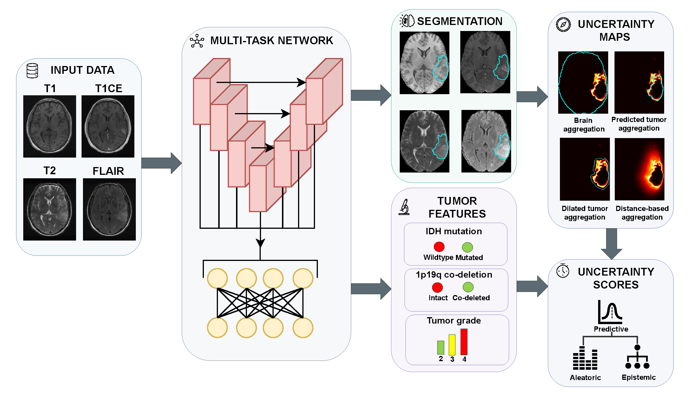
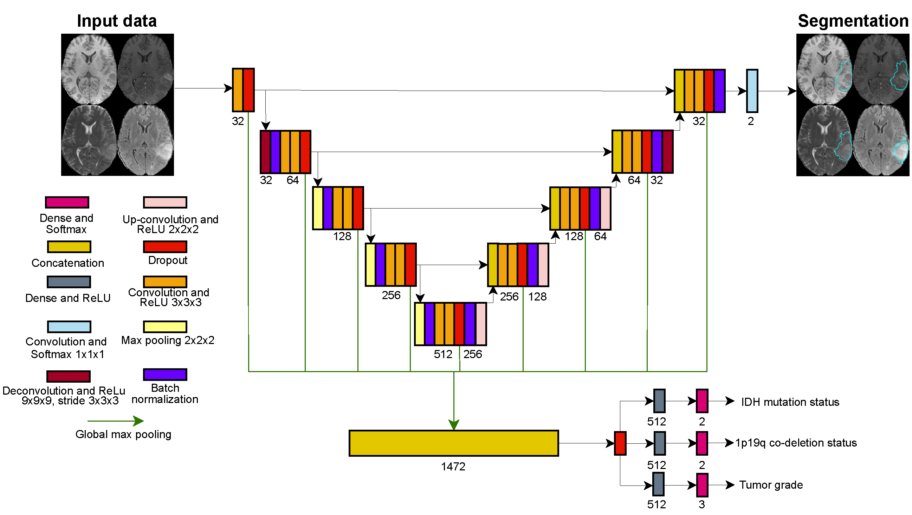

<div align="center">

# PrognosAIs-UQ

## *Towards Trustworthy AI for Glioma Diagnosis: A Task-Aware Evaluation of Uncertainty Quantification*

**Code used for the analysis presented in the paper**


</div>

This repository contains the model, inference, and uncertainty quantification
code used for the analysis presented in the accompanying paper. PrognosAIs jointly performs
glioma segmentation, IDH mutation prediction, 1p/19q co-deletion prediction,
and tumor grade prediction from structural MRI.

The paper evaluates uncertainty in a task-aware manner using Monte Carlo
dropout (MCD), deep ensembles (DE), and Monte Carlo deep ensembles (MCD-DE). It
includes classification uncertainty, voxelwise segmentation uncertainty,
regional segmentation aggregation, error-detection metrics, calibration, and
risk-coverage analysis.

## Overview



The workflow starts with MRI preprocessing. Generate brain masks if you plan
to aggregate regional uncertainty, then train and run inference or MCD. For
DE or MCD-DE, combine the independent model runs before aggregating
segmentation uncertainty.

The repository provides:

- Training and inference for the multitask PrognosAIs model.
- MCD, DE, and MCD-DE uncertainty estimation.
- Predictive, aleatoric, and epistemic uncertainty outputs.
- Segmentation uncertainty over the full volume, brain, predicted tumor,
  dilated predicted tumor, and a boundary-weighted region.
- The same model Python entry point for local GPU execution and generic Slurm jobs.

## Repository Structure

```text
PrognosAIs/
├── CSNet.png              CSNet architecture
├── framework_overview.png Framework overview
├── prognosais/
│   ├── configs/            Configuration templates
│   ├── IO/                 Data loading and configuration handling
│   ├── model/              Network, training, inference, and metrics
│   ├── pipeline/           Local and cluster entry points
│   ├── preprocessing/      MRI preprocessing and brain-mask utilities
│   └── UQ/                 MCD, DE, MCD-DE, and regional aggregation
└── requirements.txt        Pinned pip dependencies, including CUDA 12.1 PyTorch
```

## Installation

### Requirements

- Linux
- Python 3.11 or 3.12
- A CUDA-capable GPU for practical training and image inference
- An NVIDIA driver compatible with the pinned CUDA 12.1 PyTorch build
- For MCD, sufficient host RAM and a writable temporary filesystem with
  substantial free disk space for voxelwise uncertainty tensors
- Apptainer or Singularity only when generating brain masks

### Clone and Create an Environment

```bash
git clone https://github.com/ErasmusMC-NeuroOnco/PrognosAIs-UQ.git PrognosAIs-UQ
cd PrognosAIs-UQ

python3.11 -m venv .venv
source .venv/bin/activate
python -m pip install --upgrade pip
python -m pip install -r requirements.txt
```

The requirements pin PyTorch 2.4.0+cu121 and use the official CUDA 12.1 wheel
index. This build can also import on CPU-only hosts, although training and
image inference are intended for a GPU. Do not install another Torch build
into the same environment.

Verify the environment and command-line entry point:

```bash
python -c 'import torch, monai, itk; print(torch.__version__, monai.__version__, itk.Version.GetITKVersion())'
python -m prognosais.pipeline.run_local --help
dcm2niix -h
```

## Data Organization

Each case is stored in its own directory. The default preprocessed layout is:

```text
dataset/
├── labels.txt
├── Patient_001/
│   ├── PREPROCESSED/
│   │   ├── T1.nii.gz
│   │   ├── T1CE.nii.gz
│   │   ├── T2.nii.gz
│   │   ├── FLAIR.nii.gz
│   │   └── MASK.nii.gz
│   ├── REGISTERED/
│   │   └── ...
│   └── BRAIN_MASKS/
│       └── CROPPED_FROM_REGISTERED/
│           └── combined_brain_mask.nii.gz
└── Patient_002/
    └── ...
```

The tumor mask is required for segmentation training and labeled segmentation
evaluation. The brain mask is required for brain-restricted and tumor-region
uncertainty aggregation. Images and masks must be aligned on the same grid
within each stage. The `REGISTERED/` volumes are not cropped like
`PREPROCESSED/` volumes.

Labels are tab-separated and case identifiers must match the patient folder
names:

```text
Image          IDH    1p19q    Grade
Patient_001    0      -1       2
Patient_002    1       0       3
```

The provided configuration encodes:

| Task | Values |
| --- | --- |
| IDH | `0`: wildtype, `1`: mutated |
| 1p/19q | `0`: intact, `1`: co-deleted |
| Grade | `2`: grade 2, `3`: grade 3, `4`: grade 4 |
| Missing label | `-1` |

The loader uses the intersection of case identifiers in the labels file and
patient directories. It skips cases missing an enabled modality or required
segmentation mask and reports them. Conventional MRI modalities are supplied
in this order: T1, T1CE, T2, then FLAIR. The supplied template uses CSNet (see diagram below). It
can be configured for classification-only use, but that mode does not produce
segmentation outputs.



## Preprocess the MRI Data

Preprocess **each train and test cohort before model use**. Keep one patient
directory per case under a cohort root. The four supported inputs are T1,
T1CE, T2 and FLAIR NIfTI images. Tumor `MASK.nii.gz` is needed for segmentation
training and labeled evaluation, but not for unlabeled inference. Set
`data.preprocess.input_dir` to one cohort root. Make separate YAML copies in
`prognosais/configs/` for train and test, because this setting processes one
root at a time. Preprocessing does not smooth tumor masks. For both training
and test data, it saves the brain-masked, collapsed, and cropped mask as
`PREPROCESSED/MASK.nii.gz`.

Choose the matching input path:

- **DICOM:** Place series in each case's `DICOM/T1`, `DICOM/T1CE`, `DICOM/T2`
  and `DICOM/FLAIR` directories (one intended series per folder). The pip
  requirements include the `dcm2niix` executable. Check it with
  `dcm2niix -h`, then run the conversion step below first. Its output is `NIFTI/`.
  The converter handles the four scans, **not tumor annotations**: if the case
  is labeled, also supply `NIFTI/MASK.nii.gz` on its source modality's grid
  and the origin table described below. Set `already_registered: false`.
- **Raw NIfTI:** Put `T1.nii.gz`, `T1CE.nii.gz`, `T2.nii.gz`, `FLAIR.nii.gz` and,
  if available, `MASK.nii.gz` in each case's `NIFTI/`. Set
  `already_registered: false`. The preprocessor registers them to the bundled
  MNI152 atlas and writes `REGISTERED/`.
- **Already MNI-registered NIfTI:** Put the four scans and optional tumor mask
  in each case's `REGISTERED/`. Set `already_registered: true`. Registration
  is skipped, and that input folder is **not** regenerated. Verify beforehand
  that each registered image and mask shares the atlas's grid. Do not infer
  spatial status from a folder name such as `NIFTI/` alone.

#### Tumor-mask origin table when preprocessing from scratch

If you start from **DICOM or raw NIfTI** and a case has a tumor
`NIFTI/MASK.nii.gz`, provide a mask-origin table before running registration.
It identifies the *original MRI modality on whose grid the tumor mask was
drawn*, so the preprocessor can apply that modality's registration transform
to the mask. This is not the MNI atlas or a brain-mask file. Set the path in
each relevant preprocessing YAML (for example, `preprocess_train.yml`):

```yaml
data:
  preprocess:
    already_registered: false
    mask_origin_file_path: "/absolute/path/to/mask_origin.txt"
```

The file must be **tab-separated**, with exactly lowercase, case-sensitive
column names `patient` and `scan`. Use one row per case that has a raw tumor
mask. The `patient` value must match its directory name exactly. The
case-sensitive `scan` value must be `T1`, `T1CE`, `T2`, `FLAIR`, or `ALL`. Use
the source modality when known. `ALL` uses the FLAIR registration transform.
For example (the spaces between columns shown here are literal tab characters):

```text
patient	scan
Patient_001	FLAIR
Patient_002	T2
```

Missing or invalid origins for raw tumor masks cause preprocessing to fail.
Cases without a tumor mask need no row. The supplied train set's
`mask_origin.txt` has uppercase `Patient` and `Scan` headers: if reusing it
for raw registration, make a copy with lowercase headers first. For
**already registered** scans and masks, set `already_registered: true` and
leave `mask_origin_file_path: ""`. The preprocessor reads
`REGISTERED/MASK.nii.gz` directly and does not need the table.

The preprocessor registers when needed, optionally runs N4 bias-field
correction, uses the bundled MNI brain mask for skull stripping and cropping,
normalizes intensity, and writes `PREPROCESSED/`. The output directory tree is
conditional on the selected stages:

```text
parent/
├── train/                           # data.preprocess.input_dir
│   ├── labels.txt                    # supplied by you, not generated
│   └── Patient_001/
│       ├── DICOM/                     # input only, if starting with DICOM
│       ├── NIFTI/                     # supplied raw input or DICOM conversion output
│       ├── ELASTIX_PARAMETERS/        # generated only when registration runs
│       ├── REGISTERED/               # generated by registration or supplied as input
│       │   ├── T1.nii.gz ... FLAIR.nii.gz
│       │   └── MASK.nii.gz           # when a tumor mask is available
│       ├── BIASFIELD_CORRECTED/      # generated if bias_field_correction is true
│       ├── PREPROCESSED/             # model loader reads these cropped images
│       │   ├── T1.nii.gz ... FLAIR.nii.gz
│       │   └── MASK.nii.gz           # when a tumor mask is available
│       └── BRAIN_MASKS/              # separate optional extractor step below
│           ├── REGISTERED/           # one brain mask per registered modality
│           └── CROPPED_FROM_REGISTERED/
│               └── combined_brain_mask.nii.gz
└── failed_patients/                 # sibling folder for failed cases
```

`PREPROCESSED` is the output folder name. `local.yml` already points the data
loader and ground-truth UQ path there. `REGISTERED/` is the uncropped atlas-
space input for the brain-mask extractor, not an alternative model-input
folder. If a case fails, preprocessing writes a report into the case directory
and moves the **whole case** to sibling `failed_patients/`. Inspect failures
before training, and retain a separate copy of irreplaceable raw data. The
preprocessing and DICOM-conversion commands return a nonzero status if any
case fails, so Slurm `afterok` dependencies do not continue silently.

### Run preprocessing directly with Python

Activate the installed environment and run from the repository root. The
preprocessing modules accept a config name **relative to
`prognosais/configs/`**, unlike `run_local`, which accepts a full YAML path:

```bash
source .venv/bin/activate
# For DICOM input only. Repeat with the test config if needed:
python -m prognosais.preprocessing.dicom2nifti --config preprocess_train.yml
python -m prognosais.preprocessing.preprocess --config preprocess_train.yml
python -m prognosais.preprocessing.preprocess --config preprocess_test.yml
```

Omit the DICOM command for NIfTI input. Set each YAML's
`data.preprocess.input_dir` and registration/mask settings before running.
The conversion and registration/preprocessing stages are CPU jobs. For large
cohorts, run them on a compute node. Always check the resulting files and
`failed_patients/` before model training.

### Run preprocessing on any Slurm cluster

The tracked [preprocess.sbatch](prognosais/pipeline/preprocess.sbatch) runs
those same Python modules. Submit from the repository root, where `.venv/`
exists. Supply your site's account and partition options to `sbatch`. The
resource values here are examples, not dataset requirements. DICOM conversion
and preprocessing are CPU jobs. Use dependencies so a failed stage does not
start downstream work:

```bash
# If starting from DICOM, submit conversion first and use its job ID as a
# dependency on the preprocessing job. Omit this step for NIfTI input.
dicom_job=$(sbatch --parsable --cpus-per-task=4 --mem=16G --time=02:00:00 \
  prognosais/pipeline/preprocess.sbatch dicom preprocess_train.yml)
sbatch --dependency=afterok:"$dicom_job" --cpus-per-task=4 --mem=32G \
  --time=08:00:00 prognosais/pipeline/preprocess.sbatch preprocess preprocess_train.yml

# For NIfTI input, train and test roots can be submitted independently:
sbatch --cpus-per-task=4 --mem=32G --time=08:00:00 \
  prognosais/pipeline/preprocess.sbatch preprocess preprocess_train.yml
sbatch --cpus-per-task=4 --mem=32G --time=08:00:00 \
  prognosais/pipeline/preprocess.sbatch preprocess preprocess_test.yml
```

Run **either** the DICOM chain **or** the NIfTI commands for a given cohort;
do not submit the same preprocessing work twice. The repository, virtual
environment, configs and data must be visible to the compute node. See
[Submit Jobs with Slurm](#submit-jobs-with-slurm) for the model jobs.

### Brain Masks for UQ Aggregation

The preprocessor's own MNI mask is used to crop and skull-strip the scans. UQ
regional aggregation additionally requires a brain mask generated from each
modality in `REGISTERED/`. The extractor runs HD-BET or FSL BET on those
registered scans, crops the resulting masks to the bounding box of the MNI
atlas brain mask, and combines the four modality masks by union. This produces
`BRAIN_MASKS/CROPPED_FROM_REGISTERED/combined_brain_mask.nii.gz`, the default
path expected by the UQ configuration. The registered scans and atlas mask
must share the same voxel grid. If you provide an alternate atlas mask, it
must also be on that grid.

The extractor uses Apptainer/Singularity with NVIDIA passthrough for HD-BET.
Run it on a GPU-capable node or allocation with the selected container runtime
available. The registration and `PREPROCESSED/` generation steps can run on
CPU resources.

```text
Patient_001/BRAIN_MASKS/
├── REGISTERED/
│   ├── mask_brain_T1.nii.gz
│   ├── mask_brain_T1CE.nii.gz
│   ├── mask_brain_T2.nii.gz
│   └── mask_brain_FLAIR.nii.gz
└── CROPPED_FROM_REGISTERED/
    └── combined_brain_mask.nii.gz
```

#### Download the brain-extraction containers

The Python module
[`prognosais.initialization.download_containers`](prognosais/initialization/download_containers.py)
downloads both images. It uses the [HD-BET image and tags](https://hub.docker.com/r/svdvoort/hdbet/tags)
(`svdvoort/hdbet`) and [FSL image and tags](https://hub.docker.com/r/fnndsc/fsl/tags)
(`fnndsc/fsl`). At the time of writing, published example tags are
`817a50d_CUDA11.3` for HD-BET and `6.0.5.1-cuda9.1` for FSL. Replace the
`REPLACE_WITH_TAG` values in **both** preprocessing YAML copies and use one
shared, writable container directory visible to the compute nodes. For these
example tags, the config block is:

```yaml
containers:
  download_path: "/absolute/path/to/containers"
  hdbet_version: "817a50d_CUDA11.3"
  fsl_version: "6.0.5.1-cuda9.1"
```

From the repository root on a node allowed to download large images, activate
the environment and run the downloader **once**. Unlike the preprocessing
modules, its `--config` argument is a YAML *path*, not a name relative to
`prognosais/configs/`. Choose `--runtime singularity` instead if that is the
runtime installed at your site:

```bash
source .venv/bin/activate
python -m prognosais.initialization.download_containers \
  --config prognosais/configs/preprocess_train.yml --runtime apptainer
```

The module pulls `docker://svdvoort/hdbet:<tag>` and
`docker://fnndsc/fsl:<tag>`, saving them as `hdbet_<tag>.sif` and
`fsl_<tag>.sif` in `containers.download_path`. The downloader skips an image
if the expected file already exists. For the example tags, verify that
`hdbet_817a50d_CUDA11.3.sif` and `fsl_6.0.5.1-cuda9.1.sif` are present in
that directory. Keep the tag strings pinned rather than using `latest`.
Apptainer converts each OCI image into a SIF during the pull; the FSL image in
particular needs substantial temporary storage and memory during conversion.
Use a container-enabled build/transfer node with a large
temporary area. If that area is memory-backed, include it in the job's
memory request. Verify that both completed SIF files exist, then run
extraction on one case before processing a full cohort.

#### Generate the brain masks

After preprocessing has produced `REGISTERED/` and both container files are
available, run the extractor for each cohort:

```bash
python -m prognosais.preprocessing.extract_brain_masks \
  --config preprocess_train.yml
python -m prognosais.preprocessing.extract_brain_masks \
  --config preprocess_test.yml
```

The extractor uses the bundled MNI152 brain mask by default. To use another
one, pass `--mni-mask /absolute/path/to/mni_brain_mask.nii.gz`. A compatible
brain mask can instead be supplied directly, provided it is aligned to the
cropped preprocessed inputs and placed at the configured relative path.

The same step can be submitted as a GPU Slurm job after preprocessing has
finished. HD-BET uses the GPU. Some scans may use the FSL BET fallback. The
container images and runtime must be available on the compute node:

```bash
sbatch --gres=gpu:1 --cpus-per-task=4 --mem=32G --time=04:00:00 \
  prognosais/pipeline/preprocess.sbatch brain-masks preprocess_train.yml
sbatch --gres=gpu:1 --cpus-per-task=4 --mem=32G --time=04:00:00 \
  prognosais/pipeline/preprocess.sbatch brain-masks preprocess_test.yml
```

Add `--dependency=afterok:<preprocess-job-id>` to `sbatch` if queuing this
before the preceding preprocessing job has completed. The brain-mask step is
needed for regional UQ aggregation. Plain training and inference can run
without it.

## Configuration

Start with [prognosais/configs/local.yml](prognosais/configs/local.yml). It is
the portable template. Replace every `/absolute/path` placeholder.
For preprocessing, copy it to `prognosais/configs/preprocess_train.yml` and
`prognosais/configs/preprocess_test.yml`, then set the cohort root in each copy.
The Python preprocessing modules resolve these names inside
`prognosais/configs/`. The model runner accepts an
arbitrary full or relative YAML path. Use further copies for the model modes:

```bash
cp prognosais/configs/local.yml prognosais/configs/preprocess_train.yml
cp prognosais/configs/local.yml prognosais/configs/preprocess_test.yml
```

Edit those copies before running any command. They are local configuration
files containing private data paths. Do not commit them unless you intend to
publish those paths.

| Config area | Meaning and setting to check |
| --- | --- |
| `data.modalities`, `data.mask_file_name`, `data.folders` | Expected names of the four structural modalities, tumor mask, and source/registered/model-input folders. Keep `preprocessed: PREPROCESSED`. |
| `data.labels` | Case-ID and target column names in your tab-separated labels file. Edit them to match its header. Missing task labels use `-1`. |
| `data.preprocess` | Cohort root, optional raw-mask origin table, already-registered flag, and N4 bias correction. Set the cohort root separately for train/test. |
| `data.train` and `data.test` | Cohort roots, label paths, input type `preprocessed`, and `subset` fraction (`1` means all cases, `0.05` uses a small subset). `data.train.augmentation_factor` repeats only the training split. `augmentation_probability` is applied separately to each random transform. |
| `data.test.inference_mode` | `labeled` needs a real labels file. `unlabeled` needs `labels_file_path: null`. |
| `experiment.experiments_dir`, `experiment.experiment_name`, `experiment.run_name` | Output directory and names used to organize experiment results. Set Slurm account, partition, memory, time, and GPU requests in the `sbatch` command. |
| `containers` | Container destination and pinned HD-BET/FSL tags. These are needed only to generate brain masks. |
| `environment.seed`, `output_format` | Reproducibility seed and output image/table formats. Give each DE member a distinct seed and run name. |
| `model.train` | [CSNet](CSNet.png) training mode, fold count, epochs, batch size, dropout, optimizer, scheduler values, and early stopping. |
| `model.test` | Checkpoint run root and optional model directory, `best`/`last` selection, fold mode, batch size, and hard-mask/probability-map export. |
| `model.UQ` | MCD sample count and dropout. DE/MCD-DE member root, seed-folder template, seed list and count. Segmentation-region radii and mask paths. |

Recommended training and uncertainty settings:

| Setting | Template value |
| --- | --- |
| Train batch size / test batch size | `4` / `4` |
| Dropout / MCD samples | `0.25` / `30` |
| Adam learning rate / weight decay | `1e-5` / `1e-5` |
| Reduce-on-plateau minimum LR / factor / patience / threshold | `1e-11` / `0.25` / `5` / `1e-4` |
| Early-stopping delta / patience | `0` / `20` |
| Augmentation factor / per-transform probability | `1` / `0.35` |
| Fold count | `5` (if `kfold` is enabled) |

The template uses `epochs: 150` for a full training run. Choose an epoch budget
for your study and use a smaller value for a quick check. Set
`data.train.subset`/`data.test.subset` below `1` only for intentional subsets.
The supplied `local.yml` is a single-model example (`kfold: false`). Duplicate
it and change the fold flags when training or evaluating k-fold models.

Keep separate copies of this template for the workflows below:

| Config used below | Required settings |
| --- | --- |
| `single.yml` | Set `model.train.kfold: false` and `model.test.kfold: false`. Set `model.test.results_dir` to `<experiment.experiments_dir>/<experiment.experiment_name>/<experiment.run_name>`. |
| `kfold.yml` | Set `model.train.kfold: true` and `model.test.kfold: true`, with matching `num_folds`. Set `model.test.results_dir` to the k-fold run root, not a `fold_N` directory. Choose `model.test.model_type: best` or `last`. |
| `ensemble.yml` | Set `model.test.kfold: false`. Configure `model.UQ.de` and `model.UQ.mcd_de` with the ensemble root, member-folder template, seeds, and matching `num_models`. Set `model.test.results_dir` to the run root for combined UQ output. |

The direct runner does not submit Slurm jobs; request resources with `sbatch`
or use an interactive allocation. No cluster-specific YAML is needed.

Inspect any command before running it:

```bash
python -m prognosais.pipeline.run_local train \
  --config prognosais/configs/local.yml --dry-run
```

Actual runs freeze the selected YAML before launching the computation. Editing
the original YAML afterward does not alter that running job.

## Usage

Run commands from the repository root with an activated environment. In the
examples, replace the paths with your own YAML copies and an existing writable
scratch directory. The same commands also run inside a Slurm allocation.

```bash
SINGLE_CONFIG=/absolute/path/to/single.yml
KFOLD_CONFIG=/absolute/path/to/kfold.yml
ENSEMBLE_CONFIG=/absolute/path/to/ensemble.yml
SCRATCH_DIR=/absolute/path/to/scratch
mkdir -p "$SCRATCH_DIR"
```

### 1. Train a Model

```bash
python -m prognosais.pipeline.run_local train \
  --config "$SINGLE_CONFIG"

python -m prognosais.pipeline.run_local train \
  --config "$KFOLD_CONFIG"
```

The k-fold command trains every fold sequentially and writes its checkpoints
under `fold_0`, `fold_1`, and so on. To run only one zero-based fold, add
`--fold 0` (or another index below `num_folds`):

```bash
python -m prognosais.pipeline.run_local train \
  --config "$KFOLD_CONFIG" --fold 0
```

To construct a deep ensemble, train independent members with distinct
`environment.seed` values and run names, such as `dropout_025_seed_42`.

### 2. Run Inference

Set `model.test.results_dir` to the model's run directory and select a checkpoint
using `model.test.model_dir` or `model.test.model_type`.

```bash
python -m prognosais.pipeline.run_local inference \
  --config "$SINGLE_CONFIG"

python -m prognosais.pipeline.run_local inference \
  --config "$KFOLD_CONFIG"
```

The k-fold command loads each fold's checkpoint and runs inference
sequentially. Add `--fold 0` to run just one fold. Keep `model.test.results_dir`
pointing to the run root; the runner selects each `fold_N` subdirectory.

For DE segmentation, set `model.test.save_prob_map: true` and run inference for
every ensemble member. `save_predictions` controls hard-mask export. For
unlabeled inference, set `data.test.inference_mode: unlabeled` and
`data.test.labels_file_path: null`.

### 3. Estimate Uncertainty

#### Monte Carlo Dropout

Configure `model.UQ.mcd.n_samples` and `dropout_rate`. MCD writes large
intermediate tensors to temporary storage, so `--scratch-dir` must point to an
existing writable directory with substantial free **disk space**. This is
separate from the job's RAM and GPU memory requirements. The needed capacity
depends on the number and size of cases and the number of stochastic samples;
the final results filesystem also needs room when the temporary outputs are
moved there at the end of the run.

```bash
python -m prognosais.pipeline.run_local uq --method mcd \
  --config "$SINGLE_CONFIG" --scratch-dir "$SCRATCH_DIR"

python -m prognosais.pipeline.run_local uq --method mcd \
  --config "$KFOLD_CONFIG" --scratch-dir "$SCRATCH_DIR"
```

The k-fold command processes every fold sequentially; `--fold 0` restricts it
to one fold. MCD requires that the matching trained checkpoints already exist.
The selected manuscript setting is 30 stochastic passes at dropout 0.25.

#### Deep Ensemble

After training and running inference for every configured seed:

```bash
python -m prognosais.pipeline.run_local uq --method de \
  --config "$ENSEMBLE_CONFIG"
```

Run this command once. It reads all seed folders listed under `model.UQ.de` and
writes the combined result to `results/UQ/Deep_ensemble`. For each configured
seed, first train a distinct single model and run inference on the **same**
test cohort. Give each member its own `environment.seed`, `experiment.run_name`,
and `model.test.results_dir`, matching the ensemble folder template. K-fold
ensembles are not supported by this runner.

#### Monte Carlo Deep Ensemble

First run MCD for every ensemble member using the same cohort, dropout rate,
and number of samples. Then run:

```bash
python -m prognosais.pipeline.run_local uq --method mcd_de \
  --config "$ENSEMBLE_CONFIG"
```

This command runs once, reads the saved member-level MCD means, and writes the
combined result to `results/UQ/MC_DE`. It does not rerun the member networks.
For each member, first run MCD on the same test cohort with matching dropout
rate and sample count. Set `model.UQ.mcd_de` seeds and folder template to those
member run directories. K-fold MCD-DE is not supported by this runner.
Output filenames include dropout, member count, and MCD sample count, for
example `UQ_IDH_mcd_de_do025_5m_30s.csv`.

### 4. Aggregate Segmentation Uncertainty

After the corresponding UQ method has completed:

```bash
python -m prognosais.pipeline.run_local aggregate --method mcd \
  --config "$SINGLE_CONFIG"

python -m prognosais.pipeline.run_local aggregate --method de \
  --config "$ENSEMBLE_CONFIG"

python -m prognosais.pipeline.run_local aggregate --method mcd_de \
  --config "$ENSEMBLE_CONFIG"
```

For k-fold MCD aggregation, use `--config "$KFOLD_CONFIG"`; it processes every
fold, or only the fold selected by `--fold 0`.

Regional aggregation reports uncertainty over:

1. The whole image volume.
2. The brain mask.
3. The predicted tumor.
4. A dilated predicted-tumor region.
5. A distance-weighted predicted-tumor boundary region.

The ground-truth tumor is used for the Dice score and optional ground-truth
mask export, not to define the predicted-tumor uncertainty regions. An empty
predicted tumor produces an undefined regional mean rather than a false zero.

## Main Outputs

| Stage | Output |
| --- | --- |
| Training | `results/models/best_model.pt` and `results/models/last_model.pt` |
| Labeled inference | `results/metrics/preds_summary_labeled.csv` or `results/metrics/preds_summary_labeled.xlsx` |
| Unlabeled inference | `results/metrics/preds_summary_unlabeled.csv` or `results/metrics/preds_summary_unlabeled.xlsx` |
| MCD | `results/UQ/MC_dropout` |
| DE | `results/UQ/Deep_ensemble` |
| MCD-DE | `results/UQ/MC_DE` |
| Regional aggregation | `MUQ_seg_<method-settings>.csv` or `MUQ_seg_<method-settings>.xlsx`, plus optional PUM/AUM/EUM maps |

The `output_format.tables` setting selects CSV or Excel output. The
`output_format.images` setting controls the image format.

Keep separate result directories for different cohorts and configurations.
Voxelwise outputs can require substantially more host memory and storage than
their final CSV summaries.

## Interactive GPU Use

On a Slurm cluster, request an interactive GPU allocation before running the
same Python commands shown under [Usage](#usage). Replace the account and
partition names, and adjust CPUs, RAM, and wall time to your site's rules:

```bash
srun --account=YOUR_ACCOUNT --partition=YOUR_GPU_PARTITION \
  --nodes=1 --ntasks=1 --cpus-per-task=4 --gpus=1 \
  --mem=64G --time=01:00:00 --pty bash

cd /absolute/path/to/PrognosAIs
source .venv/bin/activate
python -c 'import torch; print(torch.cuda.is_available())'
python -m prognosais.pipeline.run_local inference --config "$SINGLE_CONFIG"
```

Set `SINGLE_CONFIG` to an absolute path inside the allocation if it was not
exported from the login shell. The CUDA check must print `True`. Exit the
shell when finished to release the allocation. Some sites use `--gres=gpu:1`
instead of `--gpus=1`.

## Submit Jobs with Slurm

Save the following as `run_prognosais.sbatch` on a filesystem visible to the
compute nodes. Replace the repository path and load any site-required modules
before activating the environment. The script passes its arguments to the
same direct runner used above; it does not use site-specific launchers.

```bash
#!/usr/bin/env bash
#SBATCH --job-name=prognosais
#SBATCH --nodes=1
#SBATCH --ntasks=1
#SBATCH --cpus-per-task=4
#SBATCH --output=prognosais-%j.out

set -euo pipefail
cd /absolute/path/to/PrognosAIs
source .venv/bin/activate
export MPLBACKEND=Agg
python -m prognosais.pipeline.run_local "$@"
```

From the repository root on the login node, set the four paths shown under
[Usage](#usage). The YAML files, repository, environment, data, and output
directories must be accessible on compute nodes. The repository must be
writable because the runner stores frozen config copies under
`prognosais/configs/frozen`. The MCD scratch directory must already exist on
the compute node and have sufficient free space. Slurm's `--mem` requests RAM.
It does not supply scratch disk space. Submit GPU jobs for training, inference,
and MCD:

```bash
sbatch --gres=gpu:1 --mem=64G --time=08:00:00 run_prognosais.sbatch train \
  --config "$SINGLE_CONFIG"
sbatch --gres=gpu:1 --mem=64G --time=08:00:00 run_prognosais.sbatch train \
  --config "$KFOLD_CONFIG"
sbatch --gres=gpu:1 --mem=64G --time=04:00:00 run_prognosais.sbatch inference \
  --config "$SINGLE_CONFIG"
sbatch --gres=gpu:1 --mem=64G --time=04:00:00 run_prognosais.sbatch inference \
  --config "$KFOLD_CONFIG"
sbatch --gres=gpu:1 --mem=64G --time=04:00:00 run_prognosais.sbatch uq \
  --method mcd --config "$SINGLE_CONFIG" --scratch-dir "$SCRATCH_DIR"
sbatch --gres=gpu:1 --mem=64G --time=04:00:00 run_prognosais.sbatch uq \
  --method mcd --config "$KFOLD_CONFIG" --scratch-dir "$SCRATCH_DIR"
```

After their member-level prerequisites finish, submit the ensemble-combination
jobs. These do not run the networks and normally do not require a GPU:

```bash
sbatch --mem=64G --time=02:00:00 run_prognosais.sbatch uq \
  --method de --config "$ENSEMBLE_CONFIG"
sbatch --mem=64G --time=02:00:00 run_prognosais.sbatch uq \
  --method mcd_de --config "$ENSEMBLE_CONFIG"
```

The same script accepts `aggregate --method mcd`, `de`, or `mcd_de` after the
corresponding UQ job has finished. For example:

```bash
sbatch --mem=64G --time=02:00:00 run_prognosais.sbatch aggregate \
  --method mcd --config "$KFOLD_CONFIG"
```

The CPU count, memory, and wall times above are **illustrative**, not estimates
for your dataset. Adjust them, plus `--partition`, `--account`, and the GPU
request as required by your cluster. Some partitions require a minimum CPU and
memory allocation per GPU. MCD and voxelwise aggregation can require much more
RAM and storage. Keep dependent jobs in order. Finish training before inference
or MCD, all seed-level inference before DE, and all seed-level MCD before MCD-DE.
Slurm accepts script arguments after the script path and resource requests on
the `sbatch` command line; see the [official `sbatch` reference](https://slurm.schedmd.com/sbatch.html).

## Citation

If you use this code, please cite the accompanying manuscript:

> *Towards Trustworthy AI for Glioma Diagnosis: A Task-Aware Evaluation of
> Uncertainty Quantification.*

The complete bibliographic entry will be added when publication metadata is
available.

## Support

For questions about the code, open an issue in this repository.
