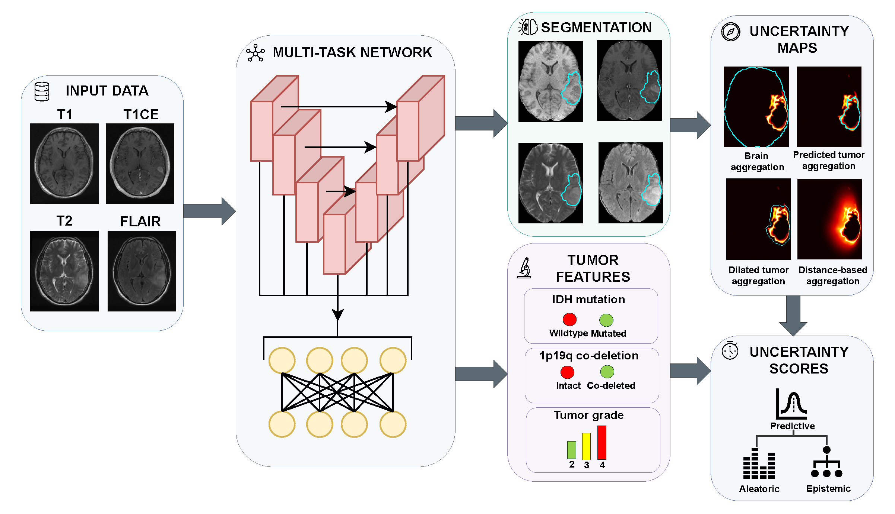
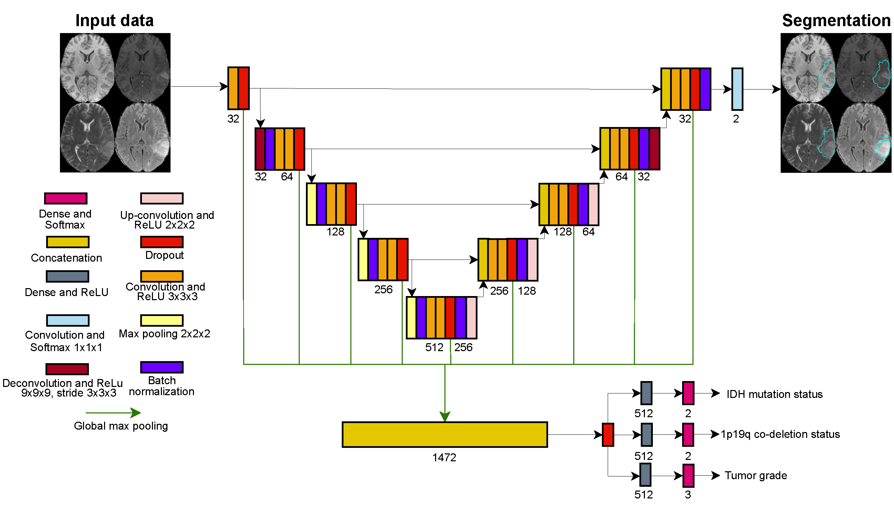

<div align="center">

# PrognosAIs-UQ

## *Towards Trustworthy AI for Glioma Diagnosis: A Task-Aware Evaluation of Uncertainty Quantification*

</div>

This repository contains the PrognosAIs-UQ framework code. It includes the model training, inference and uncertainty quantification code used for the analysis presented in the accompanying [paper](https://www.melba-journal.org/pdf/2026:033.pdf). The Classification Segmentation Network (CSNet) is the multitask neural network [1](#ref-1)
used by PrognosAIs-UQ. From structural MRI, it jointly performs glioma
segmentation, IDH mutation prediction, 1p/19q co-deletion prediction, and
tumor grade prediction.

The paper evaluates uncertainty in a task-aware fashion using Monte Carlo
Dropout (MCD), Deep Ensembles (DE), and Monte Carlo Deep Ensembles (MCD-DE). The repository
includes classification uncertainty, voxel-wise segmentation uncertainty and
regional segmentation aggregation.

## Overview



The workflow starts with MRI preprocessing. Generate brain masks for your data if you plan
to aggregate regional uncertainty, then train and run inference or MCD. For
DE or MCD-DE, combine the independent model runs before aggregating
segmentation uncertainty.

The repository provides:

- Training and inference for CSNet, the multitask model used in the PrognosAIs-UQ framework.
- MCD, DE, and MCD-DE uncertainty estimation.
- Predictive, aleatoric and epistemic uncertainty outputs.
- Segmentation uncertainty over the full MRI volume, brain, predicted tumor,
  dilated predicted tumor and a boundary-weighted region.
- A Python entry module for local GPU execution and generic Slurm jobs.

## Repository Structure

```text
PrognosAIs/
├── CSNet.png              CSNet architecture
├── framework_overview.png Framework overview
├── prognosais/
│   ├── configs/            Configuration templates
│   ├── IO/                 Data loading and configuration handling
│   ├── model/              Network, training, inference and metrics
│   ├── pipeline/           Local and cluster entry points
│   ├── preprocessing/      MRI preprocessing and brain-mask utilities
│   └── UQ/                 MCD, DE, MCD-DE and regional aggregation
└── requirements.txt        Required packages and dependencies
```

## Installation

### Requirements

- Linux
- Python 3.11 or 3.12
- A CUDA-capable GPU for model training and inference
- An NVIDIA driver compatible with the pinned CUDA 12.1 PyTorch build
- For MCD, sufficient host RAM and a writable temporary filesystem with
  substantial free disk space for voxel-wise uncertainty tensors
- Apptainer or Singularity for atlas-mask setup and brain-mask extraction

### Clone and Create an Environment

```bash
git clone https://github.com/ErasmusMC-NeuroOnco/PrognosAIs-UQ.git PrognosAIs-UQ
cd PrognosAIs-UQ

python3.11 -m venv .venv
source .venv/bin/activate
python -m pip install --upgrade pip
python -m pip install -r requirements.txt
```

The requirements pin PyTorch 2.4.0+cu121 and use the official CUDA 12.1 wheel
index. This build can also import on CPU-only hosts, although training and
image inference are intended for a GPU.

### Download the MNI152 atlas

Before preprocessing, manually download the **ICBM 2009a Nonlinear Symmetric**
MNI152 atlas [2](#ref-2) in NIFTI format
[here](https://www.bic.mni.mcgill.ca/ServicesAtlases/ICBM152NLin2009).
The archive is named `mni_icbm152_nlin_sym_09a_nifti.zip`. Choose the
**1 × 1 × 1 mm, symmetric 2009a** version.

Extract the ZIP. Inside `mni_icbm152_nlin_sym_09a/`, locate
`mni_icbm152_t1_tal_nlin_sym_09a.nii` and
`mni_icbm152_t2_tal_nlin_sym_09a.nii`. From the repository root, compress
these files into the locations expected by the preprocessor:

```bash
ATLAS_DOWNLOAD_DIR=/absolute/path/to/mni_icbm152_nlin_sym_09a
mkdir -p prognosais/preprocessing/MNI152_atlas

gzip -c "$ATLAS_DOWNLOAD_DIR/mni_icbm152_t1_tal_nlin_sym_09a.nii" \
  > prognosais/preprocessing/MNI152_atlas/mni_icbm152_t1_tal_nlin_sym_09a.nii.gz
gzip -c "$ATLAS_DOWNLOAD_DIR/mni_icbm152_t2_tal_nlin_sym_09a.nii" \
  > prognosais/preprocessing/MNI152_atlas/mni_icbm152_t2_tal_nlin_sym_09a.nii.gz
```

The atlas directory must be inside `prognosais/preprocessing/`.

#### Generate the atlas brain mask once

After downloading the templates, follow
[Download the brain-extraction containers](#download-the-brain-extraction-containers)
to obtain the container for HD-BET [3](#ref-3).
On a GPU machine, run HD-BET on the T2 atlas template and save the resulting
mask as `brain_mask.nii.gz`:  

```bash
ATLAS_DIR="$PWD/prognosais/preprocessing/MNI152_atlas"
HDBET_CONTAINER=/absolute/path/to/containers/hdbet_817a50d_CUDA11.3.sif

apptainer run --nv --no-mount hostfs \
  --bind "$ATLAS_DIR:$ATLAS_DIR" \
  "$HDBET_CONTAINER" \
  -i "$ATLAS_DIR/mni_icbm152_t2_tal_nlin_sym_09a.nii.gz" \
  -o "$ATLAS_DIR/atlas_brain.nii.gz"
mv "$ATLAS_DIR/atlas_brain_mask.nii.gz" "$ATLAS_DIR/brain_mask.nii.gz"
```

Run this from the repository root, using the pinned container tag above and
its default inference settings. Replace `apptainer` with `singularity` if
that is your installed runtime. The additional `atlas_brain.nii.gz` output
is the skull-stripped atlas and is not used by the preprocessor.

The required layout after setup is:

```text
prognosais/
└── preprocessing/
    └── MNI152_atlas/
        ├── mni_icbm152_t1_tal_nlin_sym_09a.nii.gz
        ├── mni_icbm152_t2_tal_nlin_sym_09a.nii.gz
        └── brain_mask.nii.gz
```

Use the same atlas brain mask for preprocessing all train/test cohorts and
for cropping the subject brain masks used in UQ aggregation. The atlas brain
mask is also needed when `already_registered: true`, because preprocessing
still uses it for skull stripping and cropping.

## Data Organization

Each case is stored in its own directory. The default preprocessed layout is:

```text
dataset/
├── labels.txt
├── Patient_001/
│   ├── PREPROCESSED/
│   │   ├── T1.nii.gz
│   │   ├── T1CE.nii.gz
│   │   ├── T2.nii.gz
│   │   ├── FLAIR.nii.gz
│   │   └── MASK.nii.gz
│   ├── REGISTERED/
│   │   └── ...
│   └── BRAIN_MASKS/
│       └── CROPPED_FROM_REGISTERED/
│           └── combined_brain_mask.nii.gz
└── Patient_002/
    └── ...
```

The tumor mask `MASK.nii.gz` is required for segmentation training and labeled segmentation
evaluation. The brain mask `combined_brain_mask.nii.gz` is required for brain-restricted and tumor-region
uncertainty aggregation. This mask is obtained by combining the brain masks for all modalities from the `REGISTERED` folder cropped to the bounding box of the MNI152 atlas brain mask. Images and masks must be aligned on the same grid
within each stage. The `REGISTERED/` scans are not cropped like the `PREPROCESSED/` ones are.

Labels are tab-separated and case identifiers must match the patient folder
names:

```text
Image          IDH    1p19q    Grade
Patient_001    0      -1       2
Patient_002    1       0       3
```

The provided configuration encodes:

| Task | Values |
| --- | --- |
| IDH | `0`: wildtype, `1`: mutated |
| 1p/19q | `0`: intact, `1`: co-deleted |
| Grade | `2`: grade 2, `3`: grade 3, `4`: grade 4 |
| Missing label | `-1` |

The loader uses the intersection of case identifiers in the labels file and
patient directories. It skips cases missing an enabled modality or required
segmentation mask. Structural MRI modalities are supplied
in this order: T1, T1CE, T2, FLAIR. The example configuration,
[local.yml](prognosais/configs/local.yml), uses the CSNet architecture shown
below. Set `model.classification_only: true` to run classification without
segmentation outputs.



## Preprocess the MRI Data

Preprocess each train and test cohort before model use. Keep one patient
directory per case under a cohort root. The four supported inputs are T1,
T1CE, T2 and FLAIR NIfTI images. Tumor `MASK.nii.gz` is needed for segmentation
training and labeled evaluation, but not for unlabeled inference. Set
`data.preprocess.input_dir` to one cohort root. Make separate YAML copies in
`prognosais/configs/` for train and test, because this setting processes one
dataset at a time. For both training and test data, the preprocessing module
saves the brain-masked and cropped whole-tumor mask as `PREPROCESSED/MASK.nii.gz`.

Choose the matching input path:

- **DICOM:** Place series in each case's `DICOM/T1`, `DICOM/T1CE`, `DICOM/T2`
  and `DICOM/FLAIR` directories (one intended series per folder). The pip
  requirements include the `dcm2niix` executable. Check it with
  `dcm2niix -h`. The converter handles the four scans, not tumor masks: if the case
  is labeled, also supply `NIFTI/MASK.nii.gz` on its source modality's grid
  and the origin table described below. Set `already_registered: false`.
- **Raw NIfTI:** Put `T1.nii.gz`, `T1CE.nii.gz`, `T2.nii.gz`, `FLAIR.nii.gz` and,
  if available, `MASK.nii.gz` in each case's `NIFTI/`. Set
  `already_registered: false`. The preprocessor registers them to the
  [locally installed MNI152 atlas](#download-the-mni152-atlas) and writes `REGISTERED/`.
- **Already MNI-registered NIfTI:** Put the four scans and optional tumor mask
  in each case's `REGISTERED/`. Set `already_registered: true`. Registration
  is then skipped. Verify beforehand that each registered image and mask share the atlas's grid. 

#### Tumor-mask origin table when preprocessing from scratch

If you start from DICOM or NIfTI and a case has a tumor
`NIFTI/MASK.nii.gz`, provide a mask-origin table before running registration.
It identifies the original MRI modality on whose grid the tumor mask was
drawn, so the preprocessor can apply that modality's registration transform
to the mask. Set the path in each relevant preprocessing YAML (for example, `preprocess_train.yml`):

```yaml
data:
  preprocess:
    already_registered: false
    mask_origin_file_path: "/absolute/path/to/mask_origin.txt"
```

The file must be tab-separated, with exactly lowercase, case-sensitive
column names `patient` and `scan`. Use one row per case that has a raw tumor
mask. The `patient` value must match its directory name exactly. The
case-sensitive `scan` value must be `T1`, `T1CE`, `T2`, `FLAIR`, or `ALL`. Use
the source modality when known. `ALL` uses the FLAIR registration transform.
For example:

```text
patient	scan
Patient_001	FLAIR
Patient_002	T2
```

Missing or invalid origins for raw tumor masks cause preprocessing to fail.
Cases without a tumor mask need no row. For
already registered scans and masks, set `already_registered: true` and
leave `mask_origin_file_path: ""`. The preprocessor reads
`REGISTERED/MASK.nii.gz` directly and does not need the table.

The preprocessor registers T1 and T1CE to the T1 atlas, and T2 and FLAIR to
the T2 atlas, unless the scans are already registered. It then optionally
runs N4 bias-field correction, uses the HD-BET atlas brain mask generated in [Generate the atlas brain mask once](#generate-the-atlas-brain-mask-once) for skull
stripping and cropping, normalizes intensity, and writes `PREPROCESSED/`.
The output directory tree is conditional on the selected stages:

```text
main_directory/
├── train/                           # data.preprocess.input_dir
│   ├── labels.txt                    # supplied by you, not generated
│   └── Patient_001/
│       ├── DICOM/                     # input only, if starting with DICOM
│       ├── NIFTI/                     # supplied raw input or DICOM conversion output
│       ├── ELASTIX_PARAMETERS/        # generated only when registration runs
│       ├── REGISTERED/               # generated by registration or supplied as input
│       │   ├── T1.nii.gz ... FLAIR.nii.gz
│       │   └── MASK.nii.gz           # when a tumor mask is available
│       ├── BIASFIELD_CORRECTED/      # generated if bias_field_correction is true
│       ├── PREPROCESSED/             # model loader reads these cropped images
│       │   ├── T1.nii.gz ... FLAIR.nii.gz
│       │   └── MASK.nii.gz           # when a tumor mask is available
│       └── BRAIN_MASKS/              # separate optional extractor step below
│           ├── REGISTERED/           # one brain mask per registered modality
│           └── CROPPED_FROM_REGISTERED/ 
│               └── combined_brain_mask.nii.gz
└── failed_patients/                 # folder for failed cases
```

`PREPROCESSED` is the output folder name. `local.yml` already points the data
loader and ground-truth UQ path there. `REGISTERED/` is the uncropped atlas-
space input for the brain-mask extractor. If a case fails, preprocessing writes
a report into the case directory and moves the whole case to `failed_patients/`.
Inspect failures before training. The preprocessing and DICOM-conversion commands return a nonzero status if any
case fails.

### Run preprocessing directly with Python

Activate the installed environment and run from the repository root. The
preprocessing modules accept a config name relative to
`prognosais/configs/`, unlike `run_local`, which accepts a full YAML path:

```bash
source .venv/bin/activate
# For DICOM input only. Repeat with the test config if needed:
python -m prognosais.preprocessing.dicom2nifti --config preprocess_train.yml
python -m prognosais.preprocessing.preprocess --config preprocess_train.yml
python -m prognosais.preprocessing.preprocess --config preprocess_test.yml
```

Omit the DICOM command for NIfTI input. Set each YAML's
`data.preprocess.input_dir` and registration/mask settings before running.
The conversion and registration/preprocessing stages are CPU jobs. For large
cohorts, run them on a compute node. Always check the resulting files and
`failed_patients/` before model training.

### Run preprocessing on any Slurm cluster

The tracked [preprocess.sh](prognosais/pipeline/preprocess.sh) runs
those same Python modules. Submit from the repository root, where `.venv/`
exists. Supply your site's account and compute partition options to `sbatch`. The
resource values here are examples, not dataset requirements. DICOM conversion
and preprocessing are CPU jobs. Use dependencies so a failed stage does not
start downstream work:

```bash
# If starting from DICOM, submit conversion first and use its job ID as a
# dependency on the preprocessing job. Omit this step for NIfTI input.
dicom_job=$(sbatch --parsable --cpus-per-task=4 --mem=16G --time=02:00:00 \
  prognosais/pipeline/preprocess.sh dicom preprocess_train.yml)
sbatch --dependency=afterok:"$dicom_job" --cpus-per-task=4 --mem=32G \
  --time=08:00:00 prognosais/pipeline/preprocess.sh preprocess preprocess_train.yml

# For NIfTI input, train and test roots can be submitted independently:
sbatch --cpus-per-task=4 --mem=32G --time=08:00:00 \
  prognosais/pipeline/preprocess.sh preprocess preprocess_train.yml
sbatch --cpus-per-task=4 --mem=32G --time=08:00:00 \
  prognosais/pipeline/preprocess.sh preprocess preprocess_test.yml
```

Run either the DICOM or the NIfTI commands from above for a given cohort.
The repository, virtual environment, configs and data must be visible to the compute node. See
[Submit Jobs with Slurm](#submit-jobs-with-slurm) for the model jobs.

### Brain Masks for UQ Aggregation

The HD-BET atlas mask prepared during setup is used to crop and skull-strip the scans. UQ
regional aggregation additionally requires a brain mask generated from each
modality in `REGISTERED/`. The extractor runs HD-BET [3](#ref-3) or
FSL BET [4](#ref-4) on those
registered scans, crops the resulting masks to the bounding box of the MNI
atlas brain mask, and combines the four modality masks with the union operation. This produces
`BRAIN_MASKS/CROPPED_FROM_REGISTERED/combined_brain_mask.nii.gz`, the default
path expected by the UQ configuration. The registered scans and atlas mask
must share the same voxel grid. 

The extractor uses Apptainer/Singularity with NVIDIA support for HD-BET.
Run it on a GPU-capable node or allocation with the selected container runtime
available. The registration and `PREPROCESSED/` generation steps can run on
CPU resources.

```text
Patient_001/BRAIN_MASKS/
├── REGISTERED/
│   ├── mask_brain_T1.nii.gz
│   ├── mask_brain_T1CE.nii.gz
│   ├── mask_brain_T2.nii.gz
│   └── mask_brain_FLAIR.nii.gz
└── CROPPED_FROM_REGISTERED/
    └── combined_brain_mask.nii.gz
```

#### Download the brain-extraction containers

The Python module
[`prognosais.initialization.download_containers`](prognosais/initialization/download_containers.py)
downloads both images. It uses the [HD-BET image and tags](https://hub.docker.com/r/svdvoort/hdbet/tags)
(`svdvoort/hdbet`) and [FSL image and tags](https://hub.docker.com/r/fnndsc/fsl/tags)
(`fnndsc/fsl`). At the time of writing this README, published example tags are
`817a50d_CUDA11.3` for HD-BET and `6.0.5.1-cuda9.1` for FSL. Replace the
`REPLACE_WITH_TAG` values in both preprocessing YAML copies and use one
shared, writable container directory visible to the compute nodes. For these
example tags, the config block is:

```yaml
containers:
  download_path: "/absolute/path/to/containers"
  hdbet_version: "817a50d_CUDA11.3"
  fsl_version: "6.0.5.1-cuda9.1"
```

From the repository root on a node allowed to download large images, activate
the environment and run the downloader **once**. Unlike the preprocessing
modules, its `--config` argument is a YAML *path*, not a name relative to
`prognosais/configs/`. Choose `--runtime singularity` instead if that is the
runtime installed at your site:

```bash
source .venv/bin/activate
python -m prognosais.initialization.download_containers \
  --config prognosais/configs/preprocess_train.yml --runtime apptainer
```

The module pulls `docker://svdvoort/hdbet:<tag>` and
`docker://fnndsc/fsl:<tag>`, saving them as `hdbet_<tag>.sif` and
`fsl_<tag>.sif` in `containers.download_path`. The downloader skips an image
if the expected file already exists. For the example tags, verify that
`hdbet_817a50d_CUDA11.3.sif` and `fsl_6.0.5.1-cuda9.1.sif` are present in
that directory. Keep the tag strings pinned rather than using `latest`.
Use a container-enabled build/transfer node with a large
temporary area. If that area is memory-backed, include it in the job's
memory request. Verify that both completed SIF files exist, then run
extraction on one case before processing a full cohort.

#### Generate the brain masks

After preprocessing has produced `REGISTERED/` and both container files are
available, run the extractor for each cohort:

```bash
python -m prognosais.preprocessing.extract_brain_masks \
  --config preprocess_train.yml
python -m prognosais.preprocessing.extract_brain_masks \
  --config preprocess_test.yml
```

The extractor uses `prognosais/preprocessing/MNI152_atlas/brain_mask.nii.gz`
by default. To use another one, pass
`--mni-mask /absolute/path/to/mni_brain_mask.nii.gz` and ensure it defines
the same crop used to preprocess your images.

The same step can be submitted as a GPU Slurm job after preprocessing has
finished. HD-BET uses the GPU. Some scans may use the FSL BET fallback. The
container images and runtime must be available on the compute node:

```bash
sbatch --gres=gpu:1 --cpus-per-task=4 --mem=32G --time=04:00:00 \
  prognosais/pipeline/preprocess.sh brain-masks preprocess_train.yml
sbatch --gres=gpu:1 --cpus-per-task=4 --mem=32G --time=04:00:00 \
  prognosais/pipeline/preprocess.sh brain-masks preprocess_test.yml
```

Add `--dependency=afterok:<preprocess-job-id>` to `sbatch` if queuing this
before the preceding preprocessing job has completed. The brain-mask step is
needed for regional UQ aggregation. Plain training and inference can run
without it.

## Configuration

Start with [prognosais/configs/local.yml](prognosais/configs/local.yml). It is
the portable template. Replace every `/absolute/path` placeholder.
For preprocessing, copy it to `prognosais/configs/preprocess_train.yml` and
`prognosais/configs/preprocess_test.yml`, then set the cohort root in each copy.
The Python preprocessing modules resolve these names inside
`prognosais/configs/`. The model runner accepts an
arbitrary full or relative YAML path. Use further copies for the model modes:

```bash
cp prognosais/configs/local.yml prognosais/configs/preprocess_train.yml
cp prognosais/configs/local.yml prognosais/configs/preprocess_test.yml
```

Edit those copies before running any command.

| Configuration parameter | Explanation |
| --- | --- |
| `data.modalities`, `data.mask_file_name`, `data.folders` | Expected names of the four structural modalities, tumor mask, and source/registered/model-input folders. Keep `preprocessed: PREPROCESSED`. |
| `data.labels` | Case-ID and target column names in your tab-separated labels file. Edit them to match its header. Missing task labels use `-1`. |
| `data.preprocess` | Cohort root, raw-mask origin table, already-registered flag and N4 bias correction. Set the cohort root separately for train/test. |
| `data.train` and `data.test` | Cohort roots, label paths, input type `preprocessed`, and `subset` fraction (`1` means all cases, `0.05` uses a subset of 5% of the original dataset size). `data.train.augmentation_factor` repeats only the training split. `augmentation_probability` is applied separately to each random transform. |
| `data.test.inference_mode` | `labeled` uses a real labels file to calculate evaluation metrics. `unlabeled` needs `labels_file_path: null` and produces predictions without evaluation metrics. See [inference outputs](#inference-outputs). |
| `experiment.experiments_dir`, `experiment.experiment_name`, `experiment.run_name` | Output directory and names used to organize experiment results. Set Slurm account, partition, memory, time, and GPU requests in the `sbatch` command. |
| `containers` | Container destination and pinned HD-BET/FSL tags. These are needed only to generate brain masks. |
| `environment.seed`, `output_format` | Reproducibility seed and output image/table formats. Give each DE member a distinct seed and run name. |
| `model.train` | [CSNet](CSNet.png) training mode, fold count, epochs, batch size, dropout, optimizer, scheduler values, and early stopping. |
| `model.test` | Checkpoint run root and optional model directory, `best`/`last` selection, fold mode, batch size, and masks/probability-map export. |
| `model.UQ` | MCD sample count and dropout. DE/MCD-DE member root, seed-folder template, seed list and count. Segmentation-region radii and mask paths. |

Recommended training and uncertainty settings:

| Setting | Template value |
| --- | --- |
| Train batch size / test batch size | `4` / `4` |
| Dropout / MCD samples | `0.25` / `30` |
| Adam learning rate / weight decay | `1e-5` / `1e-5` |
| Reduce-on-plateau minimum LR / factor / patience / threshold | `1e-11` / `0.25` / `5` / `1e-4` |
| Early-stopping delta / patience | `0` / `20` |
| Augmentation factor / per-transform probability | `1` / `0.35` |
| Fold count | `5` (if `kfold` is enabled) |

The template uses `epochs: 100` for a full training run. Set
`data.train.subset`/`data.test.subset` below `1` only for intentional subsets.
The supplied `local.yml` is a single-model example (`kfold: false`). Duplicate
it and change the fold flags when training or evaluating k-fold models.

Keep separate copies of this template for the workflows below:

| Config used below | Required settings |
| --- | --- |
| `single.yml` | Set `model.train.kfold: false` and `model.test.kfold: false`. Set `model.test.results_dir` to `<experiment.experiments_dir>/<experiment.experiment_name>/<experiment.run_name>`. |
| `kfold.yml` | Set `model.train.kfold: true` and `model.test.kfold: true`, with matching `num_folds`. Set `model.test.results_dir` to the k-fold run root, not a `fold_N` directory. Choose `model.test.model_type: best` or `last`, since both the best model and the last epoch model are saved when training.|
| `ensemble.yml` | Set `model.test.kfold: false`. Configure `model.UQ.de` and `model.UQ.mcd_de` with the ensemble root, member-folder template, seeds, and matching `num_models`. Set `model.test.results_dir` to the run root for combined UQ output. |

The direct runner does not submit Slurm jobs. If that is your use case, request resources with `sbatch`
or use an interactive allocation. 

Inspect any command before running it:

```bash
python -m prognosais.pipeline.run_local train \
  --config prognosais/configs/local.yml --dry-run
```
Actual runs freeze the selected YAML before launching the computation. Editing
the original YAML afterward does not alter that running job.

## Usage

Run commands from the repository root with an activated environment. In the
examples, replace the paths with your own YAML copies and an existing writable
scratch directory. The same commands also run inside a Slurm allocation.

```bash
SINGLE_CONFIG=/absolute/path/to/single.yml
KFOLD_CONFIG=/absolute/path/to/kfold.yml
ENSEMBLE_CONFIG=/absolute/path/to/ensemble.yml
SCRATCH_DIR=/absolute/path/to/scratch
mkdir -p "$SCRATCH_DIR"
```

### 1. Train a Model

```bash
python -m prognosais.pipeline.run_local train \
  --config "$SINGLE_CONFIG"

python -m prognosais.pipeline.run_local train \
  --config "$KFOLD_CONFIG"
```

The k-fold command trains every fold sequentially and writes its checkpoints
under `fold_0`, `fold_1`, and so on. To run only one zero-based fold, add
`--fold 0` (or another index below `num_folds`):

```bash
python -m prognosais.pipeline.run_local train \
  --config "$KFOLD_CONFIG" --fold 0
```

Training saves the configuration used as `<run>/information/config.yml`
and class-count figures for the patients in the training split. With the
default tasks and SVG output, these are `IDH_train_distribution.svg`,
`1p19q_train_distribution.svg`, and `Grade_train_distribution.svg` for a
single model. K-fold training saves all training-distribution figures in the shared <run>/information/ directory. Each filename includes its fold number, for example: IDH_train_distribution_fold_0.svg. 

To construct a deep ensemble, train independent members with distinct
`environment.seed` values and run names, such as `dropout_025_seed_42`.

### 2. Run Inference

Set `model.test.results_dir` to the model's run directory and select a checkpoint
using `model.test.model_dir` or `model.test.model_type`.

```bash
python -m prognosais.pipeline.run_local inference \
  --config "$SINGLE_CONFIG"

python -m prognosais.pipeline.run_local inference \
  --config "$KFOLD_CONFIG"
```

The k-fold command loads each fold's checkpoint and runs inference
sequentially. Add `--fold 0` to run just one fold. Keep `model.test.results_dir`
pointing to the run root since the runner selects each `fold_N` subdirectory.

#### Labeled and unlabeled inference

Set `data.test.inference_mode: labeled` and provide a real
`data.test.labels_file_path` when ground-truth classification labels are
available. In this mode, inference writes predictions and calculates
classification metrics against those labels. If segmentation is enabled, each
case also needs a ground-truth tumor mask in its input folder. Inference
calculates Dice and Hausdorff distance against the predicted mask. Cases
missing a required input mask are skipped.

Set `data.test.inference_mode: unlabeled` and
`data.test.labels_file_path: null` when ground truth is unavailable. This mode
writes predictions and class probabilities, plus optional predicted
segmentation masks and probability maps. It does not calculate evaluation
metrics. A tumor mask is not required.

#### Inference outputs

Let `<run>` be `model.test.results_dir`. With the supplied `local.yml` settings
(labeled inference, all three classification tasks, segmentation enabled,
`save_predictions: true`, `save_prob_map: true`, CSV tables, and SVG figures),
a successful run writes the following files:

```text
<run>/
└── results/
    ├── IDH_test_distribution.svg
    ├── 1p19q_test_distribution.svg
    ├── Grade_test_distribution.svg
    ├── metrics/
    │   ├── preds_summary_labeled.csv
    │   ├── ROC_IDH_1p19q.svg, ROC_Grade.svg, ROC_All.svg
    │   ├── PR_IDH_1p19q.svg, PR_Grade.svg, PR_All.svg
    │   ├── IDH_cm.svg, 1p19q_cm.svg, Grade_cm.svg
    │   ├── cr_idh.csv, cr_1p19q.csv, cr_grade.csv
    │   ├── segmentation_metrics.csv
    │   ├── metrics_statistics.csv
    │   └── boxplot_dice.svg, boxplot_hd.svg
    └── predictions/<case>/
        ├── PRED.nii.gz
        ├── MASK.nii.gz
        └── PROB_MAP.nii.gz
```

`preds_summary_labeled.csv` has one row per processed case: case ID and, for
each enabled classification task, its true class, predicted class, and class
probability vector. Grade classes in this table are encoded as `0`, `1`, `2`
for clinical grades `2`, `3`, `4`. The `cr_*.csv` reports contain per-class
precision, sensitivity, specificity, F1 score, and support. The ROC and PR
figures, confusion matrices, and test-distribution figures summarize the
labeled inference cohort. The test-distribution figures are in `results/`,
training's configuration copy and training-distribution figures are separately
kept in `<run>/information/` when the model has been trained.

For each processed case, `PRED.nii.gz` is the predicted tumor mask,
`MASK.nii.gz` is the ground-truth tumor mask, and `PROB_MAP.nii.gz`
contains both background and tumor probabilities as a four-dimensional NIfTI.
`segmentation_metrics.csv` contains per-case Dice and Hausdorff distance; 
`metrics_statistics.csv` contains their minimum, maximum, mean, and median.

In unlabeled mode, the table is instead
`results/metrics/preds_summary_unlabeled.csv`, with predicted classes and
probability vectors but no true-class columns. No evaluation tables or figures
are generated. If segmentation is enabled, `save_predictions: true` writes
`PRED.nii.gz` per case, and `save_prob_map: true` independently writes
`PROB_MAP.nii.gz`. A classification-only model
does not write segmentation NIfTIs or segmentation metrics in either mode.

For labeled segmentation, keep model.test.save_predictions: true: the Dice and Hausdorff calculations read the exported PRED.nii.gz and MASK.nii.gz. For Deep Ensemble segmentation, set model.test.save_prob_map: true for every member. output_format.tables can change CSV to Excel, and output_format.images can change SVG to PNG or PDF. With the direct run_local runner, k-fold inference writes each fold to <run>/fold_N/results/ but does not automatically create <run>/folds_summary/. After all labeled folds finish, run python -m prognosais.model.development.metrics_kfold --config kfold.yml, with kfold.yml in prognosais/configs/. The summary contains averaged classification-report tables and cross-fold ROC and precision-recall plots for the enabled tasks. If segmentation is enabled, it also contains per-fold and average Dice and Hausdorff statistics and their boxplots. The Slurm inference pipeline schedules this summary step after successful fold jobs. Unlabeled inference produces no fold metrics summary.

### 3. Estimate Uncertainty

#### Monte Carlo Dropout

Configure `model.UQ.mcd.n_samples` and `dropout_rate`. MCD writes large
intermediate tensors to temporary storage, so `--scratch-dir` must point to an
existing writable directory with substantial free disk space. This is
separate from the job's RAM and GPU memory requirements. The needed capacity
depends on the number and size of cases and the number of stochastic samples.
The final results filesystem also needs room when the temporary outputs are
moved there at the end of the run.

```bash
python -m prognosais.pipeline.run_local uq --method mcd \
  --config "$SINGLE_CONFIG" --scratch-dir "$SCRATCH_DIR"

python -m prognosais.pipeline.run_local uq --method mcd \
  --config "$KFOLD_CONFIG" --scratch-dir "$SCRATCH_DIR"
```

The k-fold command processes every fold sequentially: `--fold 0` restricts it
to one fold. MCD requires that the matching trained checkpoints already exist.
The selected manuscript setting is 30 stochastic passes at dropout 0.25.

#### Deep Ensemble

After training and running inference for every configured seed:

```bash
python -m prognosais.pipeline.run_local uq --method de \
  --config "$ENSEMBLE_CONFIG"
```

Run this command once. It reads all seed folders listed under `model.UQ.de` and
writes the combined result to `results/UQ/Deep_ensemble`. For each configured
seed, first train a distinct single model and run inference on the same
test cohort. Give each member its own `environment.seed`, `experiment.run_name`,
and `model.test.results_dir`, matching the ensemble folder template. 

#### Monte Carlo Deep Ensemble

First run MCD for every ensemble member using the same cohort, dropout rate,
and number of samples. Then run:

```bash
python -m prognosais.pipeline.run_local uq --method mcd_de \
  --config "$ENSEMBLE_CONFIG"
```

This command runs once, reads the saved member-level MCD means, and writes the
combined result to `results/UQ/MC_DE`. For each member, first run MCD on the same test cohort with matching dropout
rate and sample count. Set `model.UQ.mcd_de` seeds and folder template to those
member run directories. Output filenames include dropout, member count
and MCD sample count, for example `UQ_IDH_mcd_de_do025_5m_30s.csv`.

### 4. Aggregate Segmentation Uncertainty

After the corresponding UQ method has completed:

```bash
python -m prognosais.pipeline.run_local aggregate --method mcd \
  --config "$SINGLE_CONFIG"

python -m prognosais.pipeline.run_local aggregate --method de \
  --config "$ENSEMBLE_CONFIG"

python -m prognosais.pipeline.run_local aggregate --method mcd_de \
  --config "$ENSEMBLE_CONFIG"
```

For k-fold MCD aggregation, use `--config "$KFOLD_CONFIG"`: it processes every
fold, or only the fold selected by `--fold 0`.

Regional aggregation reports uncertainty over:

1. The whole image volume.
2. The brain mask.
3. The predicted tumor.
4. A dilated predicted-tumor region.
5. A distance-weighted predicted-tumor boundary region.

## Main Outputs

| Stage | Output |
| --- | --- |
| Training | `results/models/best_model.pt` and `results/models/last_model.pt` |
| Labeled inference | Predictions, classification metrics, and (when segmentation is enabled) mask-based metrics. See [full file list](#inference-outputs). |
| Unlabeled inference | Predictions and probabilities only, with no evaluation metrics. See [full file list](#inference-outputs). |
| MCD | `results/UQ/MC_dropout` |
| DE | `results/UQ/Deep_ensemble` |
| MCD-DE | `results/UQ/MC_DE` |
| Regional aggregation | `MUQ_seg_<method-settings>.csv` or `MUQ_seg_<method-settings>.xlsx`, plus optional predictive, aleatoric and epistemic uncertainty (PUM/AUM/EUM, respectively) maps |

The `output_format.tables` setting selects CSV or Excel output. The
`output_format.images` setting controls the image format.

Keep separate result directories for different cohorts and configurations.

## Interactive GPU Use

On a Slurm cluster, request an interactive GPU allocation before running the
same Python commands shown under [Usage](#usage). Replace the account and
partition names, and adjust CPUs, RAM and wall time to your site's rules:

```bash
srun --account=YOUR_ACCOUNT --partition=YOUR_GPU_PARTITION \
  --nodes=1 --ntasks=1 --cpus-per-task=4 --gres=gpu:1 \
  --mem=64G --time=01:00:00 --pty bash

cd /absolute/path/to/PrognosAIs
source .venv/bin/activate
python -c 'import torch; print(torch.cuda.is_available())'
python -m prognosais.pipeline.run_local inference --config "$SINGLE_CONFIG"
```

Set `SINGLE_CONFIG` to an absolute path inside the allocation if it was not
exported from the login shell.

## Submit Jobs with Slurm

Save the following as `run_prognosais.sh` on a filesystem visible to the
compute nodes. Replace the repository path and load any site-required modules
before activating the environment. The script passes its arguments to the
same direct runner used above (`prognosais.pipeline.run_local`), it does not use site-specific launchers.

```bash
#!/usr/bin/env bash
#SBATCH --job-name=prognosais
#SBATCH --nodes=1
#SBATCH --ntasks=1
#SBATCH --cpus-per-task=4
#SBATCH --output=prognosais-%j.out

set -euo pipefail
cd /absolute/path/to/PrognosAIs
source .venv/bin/activate
export MPLBACKEND=Agg
python -m prognosais.pipeline.run_local "$@"
```

From the repository root, set the four paths shown under
[Usage](#usage). The YAML files, repository, environment, data, and output
directories must be accessible on compute nodes. The repository must be
writable because the runner stores frozen config copies under
`prognosais/configs/frozen`. The MCD scratch directory must already exist on
the compute node and have sufficient free space. Submit GPU jobs for training, inference,
and MCD:

```bash
sbatch --gres=gpu:1 --mem=64G --time=08:00:00 run_prognosais.sh train \
  --config "$SINGLE_CONFIG"
sbatch --gres=gpu:1 --mem=64G --time=08:00:00 run_prognosais.sh train \
  --config "$KFOLD_CONFIG"
sbatch --gres=gpu:1 --mem=64G --time=04:00:00 run_prognosais.sh inference \
  --config "$SINGLE_CONFIG"
sbatch --gres=gpu:1 --mem=64G --time=04:00:00 run_prognosais.sh inference \
  --config "$KFOLD_CONFIG"
sbatch --gres=gpu:1 --mem=64G --time=04:00:00 run_prognosais.sh uq \
  --method mcd --config "$SINGLE_CONFIG" --scratch-dir "$SCRATCH_DIR"
sbatch --gres=gpu:1 --mem=64G --time=04:00:00 run_prognosais.sh uq \
  --method mcd --config "$KFOLD_CONFIG" --scratch-dir "$SCRATCH_DIR"
```

After their member-level prerequisites finish, submit the ensemble-combination
jobs. These do not run the networks and do not require a GPU:

```bash
sbatch --mem=64G --time=02:00:00 run_prognosais.sh uq \
  --method de --config "$ENSEMBLE_CONFIG"
sbatch --mem=64G --time=02:00:00 run_prognosais.sh uq \
  --method mcd_de --config "$ENSEMBLE_CONFIG"
```

The same script accepts `aggregate --method mcd`, `de`, or `mcd_de` after the
corresponding UQ job has finished. For example:

```bash
sbatch --mem=64G --time=02:00:00 run_prognosais.sh aggregate \
  --method mcd --config "$KFOLD_CONFIG"
```

The CPU count, memory, and wall times above are illustrative, not estimates
for your dataset. Adjust them, plus `--partition`, `--account`, and the GPU
request as required by your cluster. Some partitions require a minimum CPU and
memory allocation per GPU. MCD and voxel-wise aggregation can require much more
RAM and storage. Keep dependent jobs in order. Finish training before inference
or MCD, all seed-level inference before DE, and all seed-level MCD before MCD-DE.
Slurm accepts script arguments after the script path and resource requests on
the `sbatch` command line, see the [official `sbatch` reference](https://slurm.schedmd.com/sbatch.html).

## Citation

If you use this code, please cite the accompanying manuscript:

Mosquera Rojas, G. E., van der Voort, S. R., Pirkl, C. M., Kaushik, S., Smits,
M., & Klein, S. (2026). Towards trustworthy AI for glioma diagnosis: A
task-aware evaluation of uncertainty quantification. *Machine Learning for
Biomedical Imaging, 2026*(UNSURE2025 special issue), 674–700.
https://doi.org/10.59275/j.melba.2026-456d

## References

1. <a id="ref-1"></a> van der Voort, S. R., Incekara, F., Wijnenga, M. M. J.,
   Kapsas, G., Gahrmann, R., Schouten, J. W., Nandoe Tewarie, R., Lycklama,
   G. J., De Witt Hamer, P. C., Eijgelaar, R. S., French, P. J., Dubbink,
   H. J., Vincent, A. J. P. E., Niessen, W. J., van den Bent, M. J., Smits,
   M., & Klein, S. (2023). Combined molecular subtyping, grading, and
   segmentation of glioma using multi-task deep learning. *Neuro-Oncology,
   25*(2), 279–289. https://doi.org/10.1093/neuonc/noac166

2. <a id="ref-2"></a> Fonov, V. S., Evans, A. C., McKinstry, R. C., Almli,
   C. R., & Collins, D. L. (2009). Unbiased nonlinear average age-appropriate
   brain templates from birth to adulthood. *NeuroImage, 47*(Suppl. 1), S102.
   https://doi.org/10.1016/S1053-8119(09)70884-5

3. <a id="ref-3"></a> Isensee, F., Schell, M., Pflueger, I., Brugnara, G.,
   Bonekamp, D., Neuberger, U., Wick, A., Schlemmer, H.-P., Heiland, S.,
   Wick, W., Bendszus, M., Maier-Hein, K. H., & Kickingereder, P. (2019).
   Automated brain extraction of multisequence MRI using artificial neural
   networks. *Human Brain Mapping, 40*(17), 4952–4964.
   https://doi.org/10.1002/hbm.24750

4. <a id="ref-4"></a> Smith, S. M. (2002). Fast robust automated brain
   extraction. *Human Brain Mapping, 17*(3), 143–155.
   https://doi.org/10.1002/hbm.10062

## Support

For questions about the code, please open an issue in this repository.
